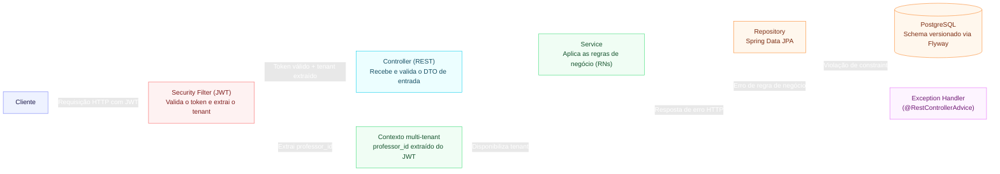

## Agenda de Aulas Particulares — API

API REST para professores particulares gerenciarem alunos, aulas agendadas e controle financeiro mensal.

## Objetivo

O projeto tem como objetivo substituir o controle manual realizado através de planilhas ou cadernos, permitindo que professores particulares acompanhem sua agenda de aulas e sua situação financeira mensal.

O sistema permite acompanhar três indicadores principais:

 **A receber:** valor referente às aulas realizadas ou previstas que ainda não foram pagas.
 **Recebido:** valor já pago pelos alunos.
 **Perdido:** valor referente a aulas que não aconteceram e que não geraram receita.

## Funcionalidades

 Cadastro e gerenciamento de alunos
 Agendamento e gerenciamento de aulas
 Controle do status das aulas
 Registro de pagamentos
 Controle financeiro mensal
 Consulta de valores a receber
 Consulta de valores recebidos
 Consulta de valores perdidos

## Tecnologias
 Java
 Spring Boot
 Spring Web
 Spring Data JPA
 PostgreSQL
 Flyway
 Maven
 Bean Validation
 JUnit
 Estrutura

# Arquitetura

O projeto segue uma arquitetura em camadas, separando responsabilidades entre:

 Controllers
 Services
 Repositories
 Entities
 DTOs
 Exceptions
 API

A API será disponibilizada através de endpoints REST para gerenciamento de:

 Alunos
 Aulas
 Pagamentos
 Controle financeiro

## Status

Setup do projeto 
